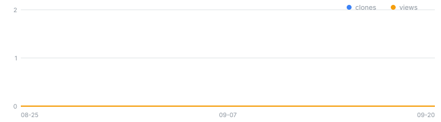

# law-openapi-mcp

<!-- mcp-name: io.github.rubatoyd/law-openapi-mcp -->

[](https://github.com/rubatoyd/law-openapi-mcp/actions/workflows/ci.yml)
[](https://github.com/rubatoyd/law-openapi-mcp/releases/latest)
[](https://github.com/rubatoyd/law-openapi-mcp/releases)

<!-- usage:start -->
> 📈 **사용량** — 최근 14일 조회 **0**회(고유 0) · 클론 **0**회(고유 0) · 릴리스 자산 누적 다운로드 **0**
>
> 
>
> <sub>2026-09-12 자동 갱신 · 전체 이력은 [`docs/usage.csv`](docs/usage.csv). GitHub 트래픽 통계는 14일 창만 제공하므로 이 저장소가 매일 찍어 누적한다.</sub>
<!-- usage:end -->

법제처 **국가법령정보 OPEN API**(law.go.kr DRF)를 검색·수집하는 MCP 서버 + CLI.

현행법령·행정규칙·자치법규·판례·헌재결정례·행정심판례·법령해석례(법제처 + 부처 39종)·
위원회 결정문·별표서식·조약·법령용어 등 **72종**을 한 인터페이스로 조회하고, 결과를
xlsx·csv·json·sqlite 로 내보낸다. 연구 자료수집 단계에서 반복 재사용하기 위한 도구다.

자매 저장소: [na-openapi-mcp](https://github.com/rubatoyd/na-openapi-mcp)(국회도서관) ·
[nl-openapi-mcp](https://github.com/rubatoyd/nl-openapi-mcp)(국립중앙도서관) ·
[kci-openapi-mcp](https://github.com/rubatoyd/KCI_openAPI) · [scienceON-mcp](https://github.com/rubatoyd/scienceON-mcp)

---

## 수집 단위는 인용 단위다

**법령 하나가 문헌 하나**다. 조문은 인용할 때의 위치로 넣지, 별도 레코드로 쪼개지 않는다.
「초·중등교육법」은 조문 135개짜리 309KB 문서지만 참고문헌에는 한 줄로 들어간다.
판례는 사건 하나, 법령해석례는 안건 하나, 조약은 조약 하나다.

본문이 필요하면 `law_body` 로 따로 받는다 — 그때는 조문이 구조로 온다.

## 준비물

`OC` 하나면 된다. [open.law.go.kr](https://open.law.go.kr) 에서 OPEN API 를 신청할 때
**가입 이메일의 @ 앞부분**을 본인이 지정하는 값이다.

```bash
cp .env.example .env    # LAW_OC=your_id 를 채운다
```

`OC` 는 비밀값이 아니다. 요청 URL에 평문으로 실리고 응답의 상세링크에도 그대로 되돌아온다.
그래도 사람마다 값이 다르므로 환경변수로 받는다.

## 설치·실행

```bash
uv sync
uv run law status                              # 연결 점검
uv run law search --target law --query 교육     # 현행법령 검색
uv run law body --target law --id 209959       # 본문 조회
uv run law collect --target law,prec --query 교육,평생교육 --format xlsx
```

MCP 등록:

```json
{
  "mcpServers": {
    "law": {
      "command": "uvx",
      "args": ["law-openapi-mcp"],
      "env": { "LAW_OC": "your_id" }
    }
  }
}
```

## MCP 도구

| 도구 | 하는 일 |
|------|---------|
| `law_status` | `OC` 보유 여부 + 실제 왕복 1회 |
| `law_targets` | 다룰 수 있는 갈래와 갈래별 실측 스키마·주의사항 |
| `law_search` | 목록 검색. `total`·`truncated`·경고를 함께 돌려준다 |
| `law_body` | 식별자 1건의 본문(조문·판시사항·질의요지 등) |
| `law_collect` | 갈래 × 검색어 조합을 모아 xlsx/csv/json/sqlite 로 저장 |
| `law_citation` | 레코드를 서지 필드(발령주체·호·시행일·제정기관)로 매핑 |

## 다루는 갈래 — 72종

| 무리 | 종수 | 보기 |
|---|--:|---|
| 법령·규칙 | 7 | `law` 현행법령 · `eflaw` 시행일법령 · `elaw` 영문법령 · `admrul` 행정규칙 · `ordin` 자치법규 · `lsStmd` 법령체계도 · `school` 학칙 |
| 판례·재결 | 3 | `prec` 판례 · `detc` 헌재결정례 · `decc` 행정심판례 |
| 법령해석 | 40 | `expc` 법제처 + **부처 39종**(`moeCgmExpc` 교육부 …) |
| 위원회 결정문 | 12 | `ppc` 개인정보보호위 · `ftc` 공정거래위 · `nlrc` 노동위 · `nhrck` 국가인권위 … |
| 특별행정심판 | 4 | `ttSpecialDecc` 조세심판원 · `kmstSpecialDecc` 해양안전심판원 … |
| 별표·서식 | 3 | `licbyl` 법령 · `admbyl` 행정규칙 · `ordinbyl` 자치법규 |
| 조약·용어 | 2 | `trty` 조약 · `lstrm` 법령용어 |
| 그 밖 | 1 | `baiPvcs` 감사원 사전컨설팅 |

전체 목록과 갈래별 실측 스키마는 `law targets` / `law_targets`,
무엇이 있는지의 지도는 [docs/DRF_CATALOG.md](docs/DRF_CATALOG.md).

**본문이 XML 로 오지 않는 4종**: `licbyl`·`ordinbyl`(별표·서식은 파일 — 목록의
`별표서식파일링크`·`별표서식PDF파일링크` 가 원문) · `moefCgmExpc`·`ntsCgmExpc`(목록만).
호출 전에 막고 대신 무엇을 보라고 알려 준다.

`lsHistory`(법령 연혁)·`couseLs`(관련법령)는 `type=XML` 을 무시하고 HTML 을 돌려주므로
이 서버는 다루지 않는다. 호출하면 그 사실을 알려 준다.

## 알아 둘 것 (전부 실측)

- 🔴 **모든 실패가 HTTP 200 이다.** 없는 target 은 0바이트, 잘못된 `OC` 는 `<Response>`,
  없는 식별자는 `<Law>일치하는 … 없습니다</Law>`. 상태코드로는 아무것도 알 수 없다.
- 🔴 **`query` 를 빼면 전체 카탈로그가 온다** — 오류가 아니다(현행법령 5,614건).
  이 서버는 빈 검색어를 거부한다.
- 🔴 **판례 본문은 데이터출처에 따라 없다.** `데이터출처명=대법원` 은 본문이 오고,
  `국세법령정보시스템` 은 목록에만 있고 본문 조회에 "일치하는 판례가 없습니다" 가 온다.
  결손으로 기록하고 넘어갈 일이지 오류가 아니다.
- `display` 상한은 500(1000을 요청하면 500으로 깎이고 `numOfRows` 에 정직하게 에코된다).
- `page` 에는 하드 상한이 없다 — `totalCnt` 전량을 회수할 수 있다.
- 갈래마다 루트 태그·레코드 태그·식별자 파라미터가 **전부 다르고 이름에서 유추할 수 없다**.
  전수 실측 62종 중 **45종이 제 이름이 아닌 레코드 태그**를 쓴다(부처 해석 39종은 전부
  `<cgmExpc>`, `ordin`·`lsStmd` 는 `<law>`, `school` 은 `<admrul>`). 식별자 파라미터도
  `ID`/`MST` 만이 아니다 — `lstrm` 은 `trmSeqs`.
- ⚠️ **`totalCnt=0` 은 target 이 무효라는 뜻이 아니다** — 검색어가 안 맞은 것일 뿐이다.

자세한 근거와 재현 방법은 [docs/LAW_API_GUIDE.md](docs/LAW_API_GUIDE.md).

## 라이선스

MIT
